## Professor
<!-- <table class="tbTy11" bordercolor="#FFFFFF" cellspacing="0" cellpadding="0" border="0">
    <tbody>
        <tr>
            <td height="150" rowspan="4" width="100"></td>
            <td rowspan="4">
            
<strong>Prof. Yun-Ho Ko</strong> 

            </td>
        </tr>
    </tbody>
</table> -->

  

      

  

  

      

      <strong>Prof. Yun-Ho Ko</strong> 
      

      

        Office: 충남대학교 공대 4호관 527호 
        Tel: +82-42-821-6860 
        E-mail: koyh@cnu.ac.kr 
      

  

<!-- 

    

        
    

    

        <strong>Prof. Yun-Ho Ko</strong> 
        Office: 충남대학교 공대 4호관 527호 
        Tel: +82-42-821-6860 
        E-mail: koyh@cnu.ac.kr 
    

 -->

<!-- 
<strong>Prof. Yun-Ho Ko</strong> 
Office: 충남대학교 공대 4호관 527호 
Tel: +82-42-821-6860 
E-mail: koyh@cnu.ac.kr -->

* **EDUCATION**  
  Ph.D. Department of Electrical Engineering & Computer Science, KAIST, Daejeon, 2002.  
  M.S. Department of Electrical Engineering & Computer Science, KAIST, Daejeon, 1997.  
  B.S. Department of Electrical Engineering, Pusan National University, 1995.

* **EXPERIENCE**  
  Senior Engineer, MCU Application Design Team, Hynix Semiconductor Inc. 2002. 9 ~ 2004. 9.

* **RESEARCH INTEREST**  
  Computer vision  
  Image compression  
  Pattern recognition  
  Augmented Reality  
  Watermarking  
  
---

<!-- |     |     |     |
|-----|-----|-----|
|

 | 
**Name**
 | 
**Ko, Yun-Ho**
 | -->

## Ph.D Candidates

|     |     |     |     |
|-----|-----|-----|-----|
|
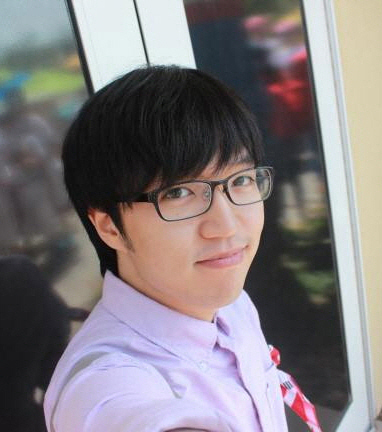
 | 
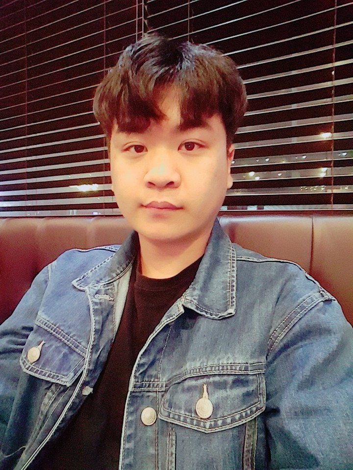
 | 

|

 |
|
<strong>안재원 (-)</strong>
 | 
<strong>강한솔 (쎄트렉아이)</strong> 
 | 
<strong>강재웅 (국방과학연구소)</strong> 
 | 
<strong>김진형 (한국항공우주연구원)</strong> 
 |
|

 | 
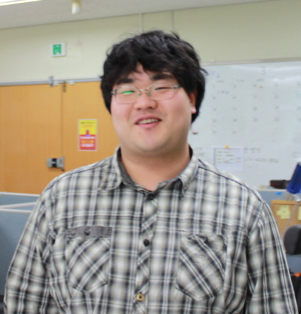
 |

| 
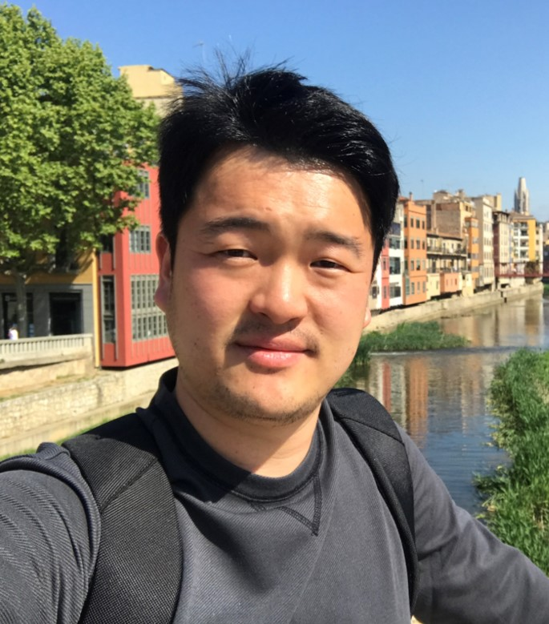
 |
|
<strong>이민규 (국방과학연구소)</strong>
 | 
<strong>유용길 ((주)번영)</strong>
 | 
<strong>김미정 (국방과학연구소)</strong> 
 | 
<strong>이영준 (선박해양플랜트연구소)</strong> 
 |

## M.S Candidates

|     |     |     |     |
|-----|-----|-----|-----|
|

 | 

 |

 | 

 |
|
<strong> 정구표 (한국항공우주연구원) </strong>
 |
<strong> 현재복 (쎄트렉아이) </strong>
 |
<strong> 이득호 (한컴인스페이스) </strong>
 |
<strong> 이진세 ((주)번영) </strong>
 | 
|

 | 

 |

 |  |
|
<strong> 함수린 </strong>
 |
<strong> 장민지 </strong>
 |
<strong> 최유경 </strong>
 | |

## Undergraduates

|     |
|-----|
| 

 |
| 
<strong> 엄강준 </strong>
|

## Alumni

|     |     |     |     |
|-----|-----|-----|-----|
|

 | 
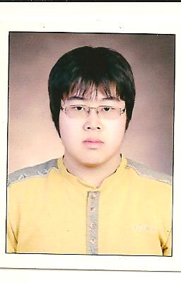
 | 
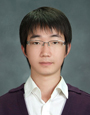
 | 
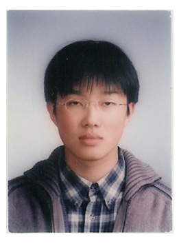
|
|
<strong>성종모 (한국전자통신연구원)</strong>
 | 
<strong>맹형열 (LG전자)</strong>
 | 
<strong>정윤호 (Silicon Works)</strong>
 | 
<strong>이태영 (Coxem)</strong>
|
|

 | 
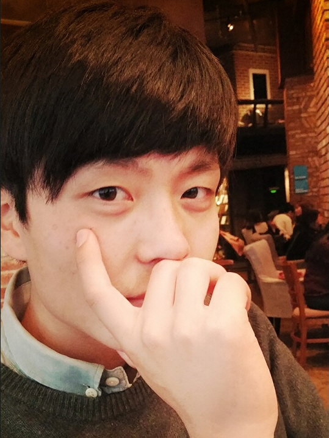
 | 
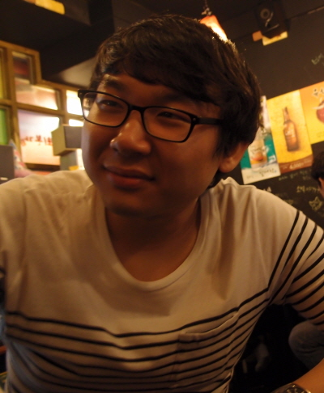
 | 
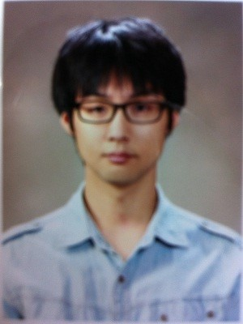
|
|
<strong>김동진 (롯데정보통신)</strong>
 | 
<strong>김진욱 (한화시스템즈)</strong>
 | 
<strong>정유철 (쎄트렉아이)</strong>
 | 
<strong>안병민 (Coxem)</strong>
|
|

 | 

 | 
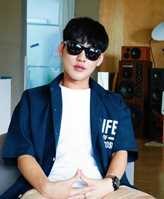
 | 
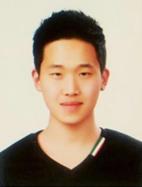
|
|
<strong>이정우 (두산중공업)</strong>
 | 
<strong>최성민 (한국항공우주연구원)</strong>
 | 
<strong>박태훈 (한국과학기술연구원)</strong>
 | 
<strong>박가용 ((주)번영)</strong>
|
|
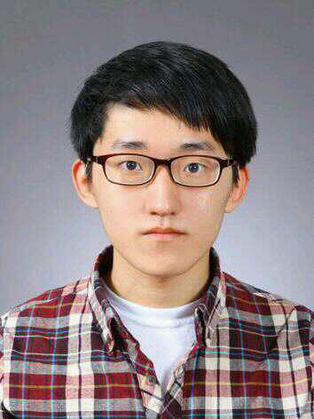
 | 
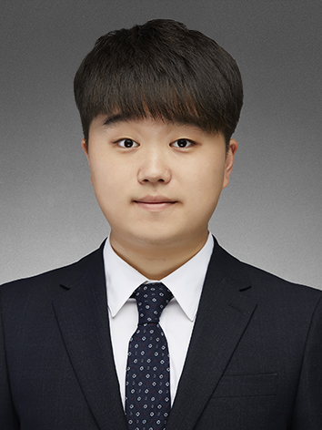
 | 

|

|
|
<strong>한병인 (-)</strong>
 | 
<strong>전현호 (국방과학연구소)</strong>
 | 
<strong>김근태 (텔레칩스)</strong>
|
<strong>김현종 (KAIST)</strong>
 |
|

 | 
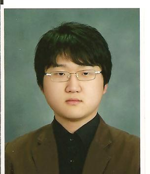
 |
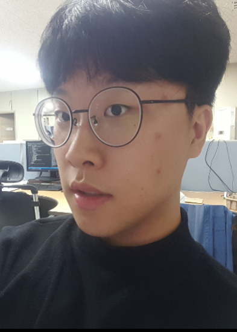
 |
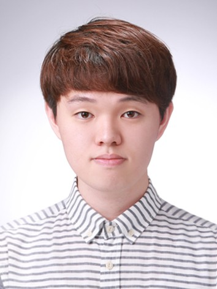
 |
|
<strong>박규하 (CNU)</strong>
 | 
<strong>김태원 (레인보우로보틱스)</strong>
 | 
<strong> 송재열 (레인보우로보틱스) </strong>
 |
<strong> 민경철 (쎄트렉아이) </strong>
 |
